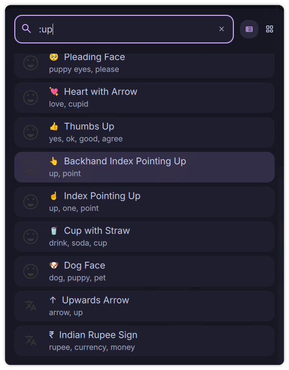

# Emoji & Unicode Launcher

A DankMaterialShell launcher plugin that provides quick access to 300+ emojis and 100+ unicode characters with instant clipboard copying.



## Features

- **300+ Searchable Emojis** - Access popular emojis with smart keyword search
- **100+ Unicode Characters** - Math symbols, currency signs, arrows, Greek letters, and more
- **Instant Copy** - One-click copy to clipboard with visual confirmation
- **Smart Search** - Search by name, character, or keywords
- **Configurable Trigger** - Default `:` or set your own trigger (or disable for always-on)
- **Toast Notifications** - Visual feedback for every action

## Installation

### From Plugin Registry (Recommended)
```bash
# Coming soon - will be available via DMS plugin manager
```

### Manual Installation
```bash
# Copy plugin to DMS plugins directory
cp -r EmojiLauncher ~/.config/DankMaterialShell/plugins/

# Enable in DMS
# 1. Open Settings (Ctrl+,)
# 2. Go to Plugins tab
# 3. Click "Scan for Plugins"
# 4. Toggle "Emoji & Unicode Launcher" to enable
```

## Usage

### Default Trigger Mode
1. Open launcher (Ctrl+Space)
2. Type `:` followed by search query
3. Examples:
   - `:smile` - Find smiling emojis
   - `:heart` - Find heart emojis
   - `:copyright` - Find © symbol
   - `:arrow` - Find arrow characters
4. Select item and press Enter to copy

### Always-On Mode
Configure in settings to show emoji/unicode items without a trigger prefix.

## Search Examples

**Emojis:**
- `smile` → 😀 😃 😄 😁 😊
- `heart` → ❤️ 🧡 💛 💚 💙 💜
- `fire` → 🔥
- `star` → ⭐ ✨ 🌟

**Unicode Characters:**
- `copyright` → ©
- `trademark` → ™
- `degree` → °
- `pi` → π
- `arrow` → → ← ↑ ↓
- `infinity` → ∞
- `euro` → €

## Configuration

Access settings via DMS Settings → Plugins → Emoji & Unicode Launcher:

- **Trigger**: Set custom trigger character (`:`, `;`, `/emoji`, etc.) or disable for always-on mode
- **No Trigger Mode**: Toggle to show items without trigger prefix

## Character Database

### Emojis (300+)
- Faces & emotions
- Hearts & love
- Hands & gestures
- Animals & nature
- Food & drink
- Activities & objects
- Symbols & flags

### Unicode Characters (100+)
- **Math**: ∞ √ ∑ ∫ ∂ π ≈ ≠ ≤ ≥
- **Currency**: € £ ¥ ₹ ₽ ₩
- **Arrows**: → ← ↑ ↓ ↔ ⇒ ⇐
- **Symbols**: © ® ™ § ¶ † ‡ • ◦
- **Greek**: α β γ δ ε θ λ μ σ Ω
- **Quotes**: … – —
- **Music**: ♪ ♫ ♬ ♭ ♮ ♯

## Requirements

- DankMaterialShell >= 0.1.0
- `wl-copy` (from wl-clipboard package)
- Wayland compositor (Niri, Hyprland, etc.)

## Compatibility

- **Compositors**: Niri and Hyprland
- **Distros**: Universal - works on any Linux distribution

## Technical Details

- **Type**: Launcher plugin
- **Trigger**: `:` (configurable)
- **Language**: QML (Qt Modeling Language)
- **Dependencies**: None (uses built-in character database)

## Contributing

Found a bug or want to add more characters? Open an issue or submit a pull request!

## License

MIT License - See LICENSE file for details

## Author

Created for the DankMaterialShell community

## Links

- [DankMaterialShell](https://github.com/AvengeMedia/DankMaterialShell)
- [Plugin Registry](https://github.com/AvengeMedia/dms-plugin-registry)
