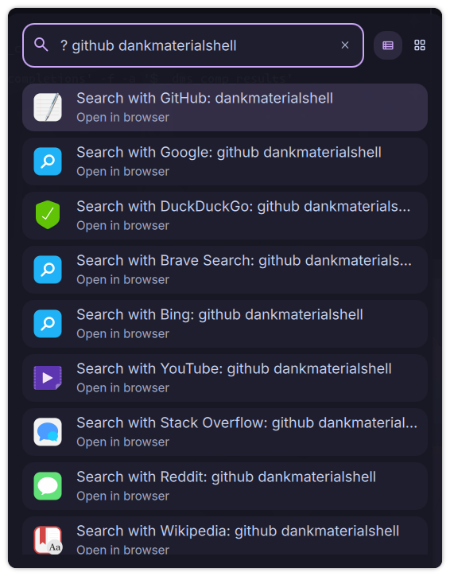

# Web Search

A DankMaterialShell launcher plugin for searching the web with 23+ built-in search engines and support for custom search engines.



## Features

- **23+ Built-in Search Engines** - Google, DuckDuckGo, GitHub, Stack Overflow, and more
- **Custom Search Engines** - Add your own search engines with URL templates
- **Keyword-Based Selection** - Type keywords to use specific engines (e.g., `github rust`)
- **Configurable Default Engine** - Set your preferred search engine
- **One-Click Search** - Select and press Enter to open browser
- **Toast Notifications** - Visual feedback for every search
- **Configurable Trigger** - Default `?` or set your own trigger

## Installation

### From Plugin Registry (Recommended)
```bash
# Coming soon - will be available via DMS plugin manager
```

### Manual Installation
```bash
# Copy plugin to DMS plugins directory
cp -r WebSearch ~/.config/DankMaterialShell/plugins/

# Enable in DMS
# 1. Open Settings (Ctrl+,)
# 2. Go to Plugins tab
# 3. Click "Scan for Plugins"
# 4. Toggle "Web Search" to enable
```

## Usage

### Basic Search
1. Open launcher (Ctrl+Space)
2. Type `?` followed by search query
3. Examples:
   - `? rust tutorials` - Search with default engine
   - `? linux kernel` - General search
4. Select engine and press Enter to open browser

### Engine-Specific Search
Use keywords to search specific engines directly:
- `? github awesome-linux` - Search GitHub
- `? youtube music video` - Search YouTube
- `? wiki quantum physics` - Search Wikipedia
- `? stackoverflow async rust` - Search Stack Overflow

## Built-in Search Engines

### General Search
- **Google** - Keywords: `google`, `search`
- **DuckDuckGo** - Keywords: `ddg`, `duckduckgo`, `privacy`
- **Brave Search** - Keywords: `brave`, `privacy`
- **Bing** - Keywords: `bing`, `microsoft`

### Development
- **GitHub** - Keywords: `github`, `code`, `git`
- **Stack Overflow** - Keywords: `stackoverflow`, `stack`, `coding`
- **npm** - Keywords: `npm`, `node`, `javascript`
- **PyPI** - Keywords: `pypi`, `python`, `pip`
- **crates.io** - Keywords: `crates`, `rust`, `cargo`
- **MDN Web Docs** - Keywords: `mdn`, `mozilla`, `web`, `docs`

### Linux & Packages
- **Arch Linux Packages** - Keywords: `arch`, `linux`, `packages`
- **AUR** - Keywords: `aur`, `arch`, `packages`

### Social & Media
- **YouTube** - Keywords: `youtube`, `video`, `yt`
- **Reddit** - Keywords: `reddit`
- **Twitter/X** - Keywords: `twitter`, `x`, `social`
- **LinkedIn** - Keywords: `linkedin`, `job`, `professional`

### Reference
- **Wikipedia** - Keywords: `wikipedia`, `wiki`
- **Google Translate** - Keywords: `translate`, `translation`
- **IMDb** - Keywords: `imdb`, `movies`, `tv`

### Shopping
- **Amazon** - Keywords: `amazon`, `shop`, `shopping`
- **eBay** - Keywords: `ebay`, `shop`, `auction`

### Utilities
- **Google Maps** - Keywords: `maps`, `location`, `directions`
- **Google Images** - Keywords: `images`, `pictures`, `photos`

## Custom Search Engines

Add your own search engines via Settings:

1. Open Settings → Plugins → Web Search
2. Scroll to "Custom Search Engines"
3. Fill in the form:
   - **ID**: Unique identifier (e.g., `myengine`)
   - **Name**: Display name (e.g., `My Search Engine`)
   - **Icon**: Material Design icon name (e.g., `search`)
   - **URL**: Search URL with `%s` placeholder
   - **Keywords**: Comma-separated keywords for quick access

### Example Custom Engines

**Rust Documentation:**
```
ID: rustdoc
Name: Rust Docs
Icon: code
URL: https://doc.rust-lang.org/std/?search=%s
Keywords: rust,docs,documentation
```

**Arch Wiki:**
```
ID: archwiki
Name: Arch Wiki
Icon: menu_book
URL: https://wiki.archlinux.org/index.php?search=%s
Keywords: arch,wiki,documentation
```

**GitLab:**
```
ID: gitlab
Name: GitLab
Icon: code
URL: https://gitlab.com/search?search=%s
Keywords: gitlab,code
```

## Configuration

Access settings via DMS Settings → Plugins → Web Search:

- **Trigger**: Set custom trigger (`?`, `/`, `/search`, etc.) or disable for always-on mode
- **Default Search Engine**: Choose your preferred engine (Google, DuckDuckGo, Brave, Bing)
- **Custom Search Engines**: Add/manage your own search engines

## Search Examples

### General Queries
```
? rust programming         # Search with default engine
? how to install arch      # General search
```

### Development
```
? github awesome-linux     # Search GitHub
? stackoverflow async rust # Search Stack Overflow
? npm react hooks          # Search npm packages
? pypi requests            # Search Python packages
```

### Linux
```
? arch firefox             # Search Arch packages
? aur brave-bin            # Search AUR
? wiki systemd             # Search Wikipedia
```

### Media
```
? youtube rust tutorial    # Search YouTube
? reddit linux gaming      # Search Reddit
? imdb inception           # Search IMDb
```

## Requirements

- DankMaterialShell >= 0.1.0
- Web browser (default system browser via `xdg-open`)
- Wayland compositor

## Compatibility

- **Compositors**: Niri and Hyprland
- **Distros**: Universal - works on any Linux distribution
- **Browsers**: Works with any default browser

## Technical Details

- **Type**: Launcher plugin
- **Trigger**: `?` (configurable)
- **Language**: QML (Qt Modeling Language)
- **Browser Launch**: Uses `xdg-open` for system default browser

## Tips & Tricks

1. **Keyword Shortcuts**: Type engine keywords first for direct search
   - `github rust` instead of `? github rust`

2. **Combine Keywords**: Use multiple keywords to narrow results
   - `stackoverflow rust async await`

3. **Custom Engines**: Add frequently-used sites for quick access
   - Add your company's internal documentation
   - Add specialized search engines for your workflow

## Contributing

Want to add more built-in search engines? Open an issue or submit a pull request!

## License

MIT License - See LICENSE file for details

## Author

Created for the DankMaterialShell community

## Links

- [DankMaterialShell](https://github.com/AvengeMedia/DankMaterialShell)
- [Plugin Registry](https://github.com/AvengeMedia/dms-plugin-registry)
